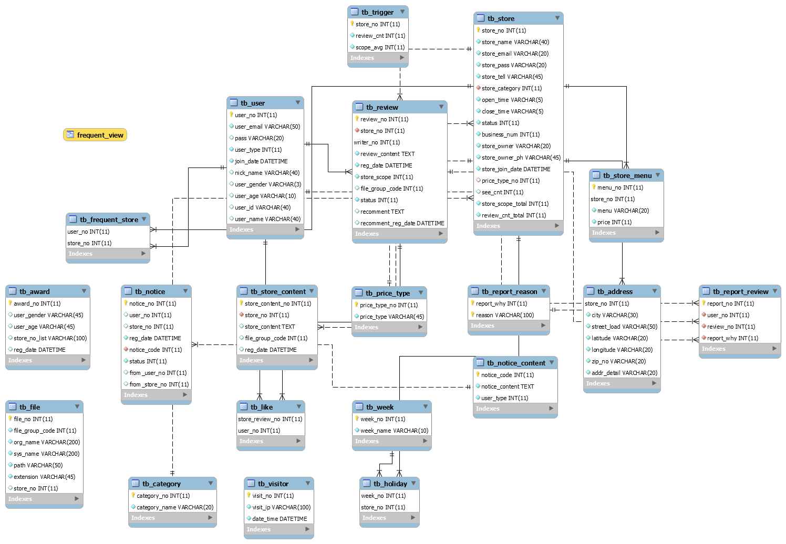

# 심야식당 서비스

## 개요
*현재 영업 중 인 식당의 정보를 
접속 위치 기반으로 여러 조건에 맞게 제공하는 웹 서비스*

## 주요 기술
- Java, JSP, JSTL, EL
- jQuery, Ajax, JSON
- HTML, CSS, Javascript, BootStrap, jQueryPlugin
- mysql, mybatis
- google map API, KAKAO login API,  Naver login API

## ERD

## 역할
- 전체 DB Table 설계
- 검색 결과 데이터 요청 및 출력, 웹 화면 구성
- 알림 기능
- 최근 본 맛집 기능

### 검색

카테고리, 지역, 가격대, keyword별 검색이 가능하고, 서비스 목적에 맞도록 현재 시간과 비교하여 영업 중인 store 결과값을 default로 설정하였다.

### 내 주변 맛집 찾기

구글 API를 통해 구현한 지도에서 현재 내 위치의 좌표 값을 받아와 DB의 자료와 비교하여
결과를 도출하였다.

### 알림 기능

이슈마다 알림을 발생하게 하여 링크를 설정해놓았다.

### 최근 본 맛집 기능

localstorage를 이용하여 조회하였던 값들을 가져오도록 설정하였다.
